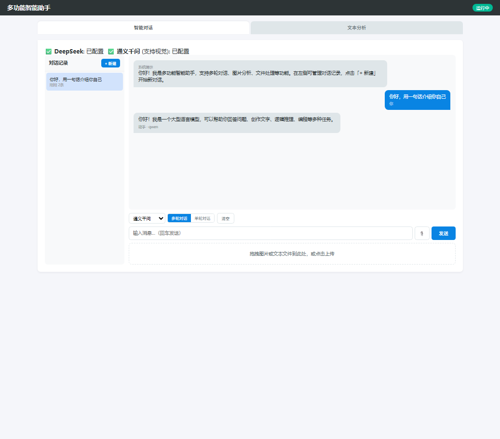
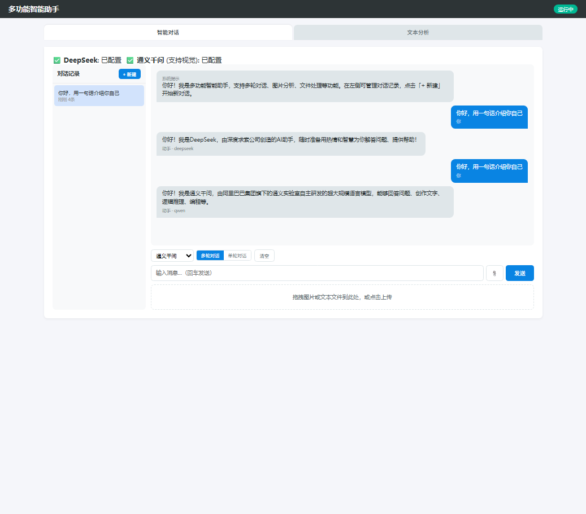
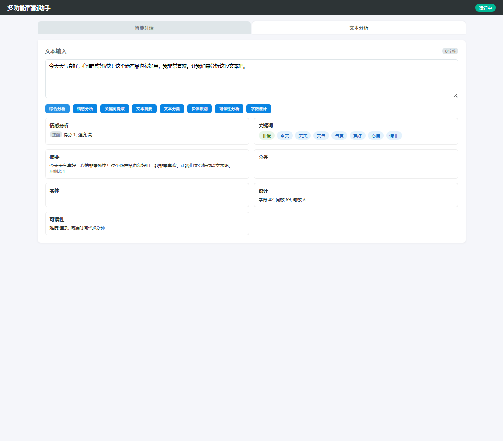

# Python 多功能智能助手（Smart Assistant）

一个基于 Flask 的 Web 智能助手项目，集成 **大模型对话、数据分析可视化、自然语言处理（NLP）、Agent 智能体** 四大能力，提供统一的 Web 界面与 RESTful API。

---

## 一、项目简介

本项目面向"一站式智能助手"场景，用户在网页上即可完成：

- **智能对话**：对接 DeepSeek / 通义千问双大模型，支持流式输出、多轮对话、图片提问；
- **数据分析**：上传 CSV / Excel / JSON / TXT，自动生成描述性统计、直方图、频数分布、相关性热力图；
- **NLP 文本处理**：情感判别、关键词提取、自动摘要、实体识别、文本分类等 7 项能力；
- **Agent 智能体**：基于 Function Calling 的 ReAct 循环，可自主规划、调用工具、边想边答。

项目采用分层架构，模块化设计，对话历史用 SQLite 持久化，便于维护与扩展。

## 界面展示

智能对话（DeepSeek）：



智能对话（通义千问，同屏对比双模型）：



文本分析（情感判别 / 关键词 / 摘要 / 统计）：



---

## 二、技术栈

| 分类 | 技术 / 工具 |
|---|---|
| 后端框架 | Flask（工厂模式 + 蓝图 Blueprint） |
| 大模型对接 | DeepSeek、通义千问（OpenAI 兼容接口）、requests、SSE 流式 |
| Agent | Function Calling、ReAct 循环、Planner 规划 |
| 数据处理 | pandas、numpy、matplotlib |
| NLP | nltk、scikit-learn（TF-IDF） |
| 数据存储 | SQLite（对话会话与消息历史持久化） |
| 日志 | Python logging（控制台 + 文件） |
| 跨域 | Flask-Cors |
| 测试 | pytest |

---

## 三、项目结构

```
smart-assistant/
├── app.py
├── config.py
├── run.py
├── requirements.txt
├── .env.example
├── routes/
│   ├── chat.py
│   ├── chart.py
│   ├── nlp.py
│   └── agent.py
├── services/
│   ├── llm_service.py
│   ├── chart_service.py
│   ├── nlp_service.py
│   ├── agent.py
│   └── db.py
├── utils/
│   └── helpers.py
├── templates/
│   └── index.html
├── tests/
│   ├── conftest.py
│   ├── test_nlp.py
│   └── test_system.py
└── data/
```

---

## 四、核心功能

1. **双模型对话**：前端传入 `provider`，后端动态切换 DeepSeek / 通义千问；主模型超时或报错时自动降级到备用模型。
2. **SSE 流式输出**：模型逐字生成、实时推送，前端边收边渲染 Markdown。
3. **多轮对话持久化**：会话与消息存入 SQLite，重启服务不丢失；历史过长时自动摘要压缩，控制 token 成本。
4. **数据分析可视化**：上传表格自动统计并出图，图片以 Base64 返回前端展示。
5. **多模态**：支持图片提问（需模型支持视觉能力）。
6. **接口测试**：pytest 覆盖正常请求、错误参数、空输入、文件上传等场景。

### Agent 智能体能力

- **Planner-Worker 架构**：先把任务拆成计划展示，再逐步调用工具执行；
- **8 个工具**：读文件、文本分析、画图表、计算器、导出报告、数据描述、历史查询、联网搜索；
- **权限闸门**：有副作用的工具（如导出文件）需用户确认后才执行；
- **可中断**：前端 AbortController 随时停止生成；
- **自动降级与重试**：模型调用失败自动重试、切换备用模型。

---

## 五、快速运行

```bash
# 1. 安装依赖
pip install -r requirements.txt

# 2. 配置密钥（复制模板并填入自己的 key）
copy .env.example .env    # Windows
# 编辑 .env，填入 DEEPSEEK_API_KEY / QWEN_API_KEY

# 3. 启动
python run.py
```

启动后访问：<http://127.0.0.1:5000/>

---

## 六、主要接口

| 方法 | 路径 | 说明 |
|---|---|---|
| GET | `/api/health` | 健康检查 |
| POST | `/api/chat/send` | 发送对话 |
| POST | `/api/chat/upload` | 上传图片 / 文本 |
| GET | `/api/chat/history` | 查询对话历史 |
| GET | `/api/chat/sessions` | 会话列表（SQLite） |
| GET | `/api/chat/providers` | 查询可用模型 |
| POST | `/api/chart/generate` | 上传数据并出图 |
| POST | `/api/nlp/sentiment` | 情感判别 |
| POST | `/api/nlp/keywords` | 关键词提取 |
| POST | `/api/agent/chat/stream` | Agent 流式对话（SSE） |
| POST | `/api/agent/execute_tool` | 用户确认后执行工具 |

---

## 七、个人负责部分

- 整体架构设计：用 Flask 工厂函数 + 蓝图把对话、画图、NLP、Agent 拆成独立模块；
- 封装大模型统一服务层：双模型切换、失败降级、SSE 真逐 token 流式输出；
- 设计并实现 Agent：Function Calling 工具调用、ReAct 循环、Planner 规划、历史摘要、权限确认；
- 对话历史 SQLite 持久化与结构化日志；
- 设计并执行 pytest 测试用例，覆盖正常与异常场景。
